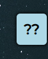
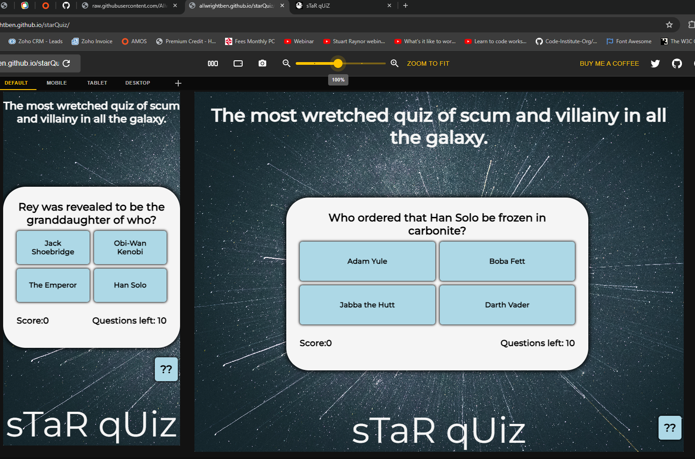

## Overview

Welcome to my web game quiz about the Star Wars movie franchise! This README file provides essential information about the website, its purpose, and how to get started.

The website can be accessed by this [Link](https://allwrightben.github.io/starquiz/)

## Introduction

This Star Wars quiz game (Star Quiz) will allow Star Wars fans to test their knowledge and maybe even learn something new. It's also great for non-Star Wars fans to see how they do even though they wouldn't consider themselves to be a big fan. Visitors to this website can quickly and easily start the game and since the questions are different every time they can try again and again and have a different experience each time

## User Stories
<h3>First Time Visitor Goals:</h3>

- As a first-time visitor, I want to easily understand the main purpose of the site and what it does.
- As a first-time visitor, I want to easily navigate the controls of the game.
- As a first-time visitor, I want to quickly start the game since that's what I'm here for.

<h3>Returning Visitor Goals:</h3>

- As a returning visitor, I want to try my luck again to see if I can improve my score.
- As a returning visitor, I want to see the same familiar game layout so I can get straight into a new game.
- As a returning visitor, I want to test my knowledge again but not have the exact same experience again otherwise I'll just memorize the questions.

<h3>Frequent Visitor Goals:</h3>

- As a frequent visitor, I want to keep practicing to improve my knowledge and my score.
- As a frequent visitor, I want to get my friends to have a go as well and see who gets the highest score.

<h3>Target Audience Is:</h3>

- Interested in Quizzes.
- Interested in Star Wars.
- Interested in learning about Star Wars.
- Interested in fun.

## Features

<h3>The website exists on one page only with multiple features visible to the user:</h3>

- At the top of the page, a Star Wars reference can be seen, which references the famous Alec Guinness quote "Mos Eisley, The most wretched hive of scum and villainy in all the galaxy".
 

- At the bottom of the page, the name of the game (sTaR qUiZ) can be seen in large letters.
 

- In the middle of the page is a simple "Start" button for the user to start the game. 

- And in case the user is unsure of how a quiz works or the rules, there is a button to the right of the screen that will bring up a pop-up where they can quickly find out how it all works.
 

- When the user clicks start it will show the first question.
- The user will also see their score in the bottom left.
- The user will also see how many questions they have remaining in the bottom right
 

- All of the buttons on the site offer the user feedback with on-hover animations and pointers.
- within the quiz, the user will get instant feedback for a correct answer.
- The user will also now only be able to click the next button as all the answer buttons are disabled.
- The user will see that their score has increased by 1, and they now only have 9 questions remaining. 
 

- The user will also get feedback for an incorrect answer.
- the user will see that the answer they selected is now red, indicating that it was a wrong answer, and they didn't get a point and they have one less question to answer.
 

- Each time the user selects one of four answers the correct answer will turn green and all other answers will be red.

- Using the site is intuitive and easy to understand.
- The website is responsive.
  - on laptop screen sizes and larger, the website will feature larger text and buttons.
  - on tablet screen sizes and smaller, the website text and buttons will be smaller.

## Technologies Used

- [HTML](https://developer.mozilla.org/en-US/docs/Web/HTML) was used as the foundation of the site.
- [CSS](https://developer.mozilla.org/en-US/docs/Web/css) was used to add the styles and layout of the site.
- [CSS Flexbox](https://developer.mozilla.org/en-US/docs/Learn/CSS/CSS_layout/Flexbox) was used to arrange items symmetrically on the pages.
- [JavaScript](https://developer.mozilla.org/en-US/docs/Web/JavaScript) was used to create all the logic and visuals necessary to make the quiz work.
- [VSCode](https://code.visualstudio.com/) was used as the main tool to write and edit code.
- [Git](https://git-scm.com/) was used for the version control of the website.
- [GitHub](https://github.com/) was used to host the code of the website.

## Testing

<h3>Compatability</h3>

In order to confirm the correct functionality, responsiveness and appearance:
- The website was tested on Chrome and Edge web browsers, using in-built dev tools.
  - Chrome:
  
  
  
  
  

  - Edge:
  
  
  
  
  

- The website was also tested using the Chrome extension [Responsive Viewer](https://chromewebstore.google.com/detail/responsive-viewer/inmopeiepgfljkpkidclfgbgbmfcennb?pli=1)
    
     

- The website's responsiveness was tested using Media Genesis Responsive design checker
https://responsivedesignchecker.com/
 

- The HTML file has passed HTML validity checks with W3C.
 

- The CSS file has also passed CSS validity check with W3C.
 

- The JavaScript was tested for errors using JShint
 

- Lighthouse
  - The website has been tested for performance, accessibility, best practice and SEO. 

    

## Deployment

### Deployment to GitHub Pages

- The site was deployed to GitHub pages. The steps to deploy are as follows: 
  - In the [GitHub repository](https://github.com/Allwrightben/starquiz), navigate to the Settings tab 
  - From the source section drop-down menu, select the **Main** Branch, then click "Save".
  - The page will be automatically refreshed with a detailed ribbon display to indicate the successful deployment.

  The live link can be found [here](https://allwrightben.github.io/starquiz/)

## Contact

Ben Allwright 
ben.allwright@learningpeople.co.uk

Feel free to reach out if you have any questions or feedback! Thank you for visiting  https://github.com/Allwrightben/starquiz

## Credits

- <h3>Inspiration</h3>

  - The Love Math project and JavaScript modules gave me a lot of inspiration.
  - My mentor Juliia I must say has been amazing, far beyond what I would have expected :)

- <h3>Media</h3>

- The website features one background image sourced from https://unsplash.com/

